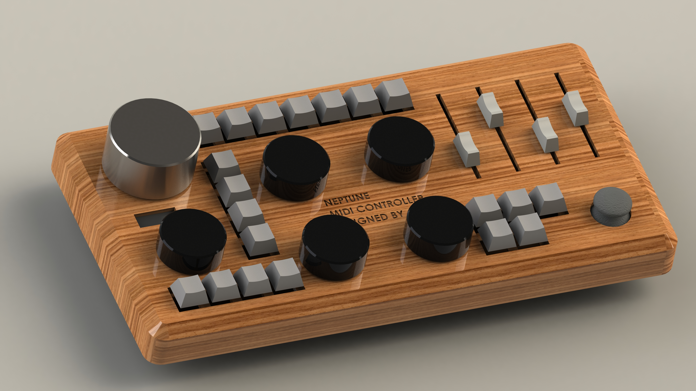
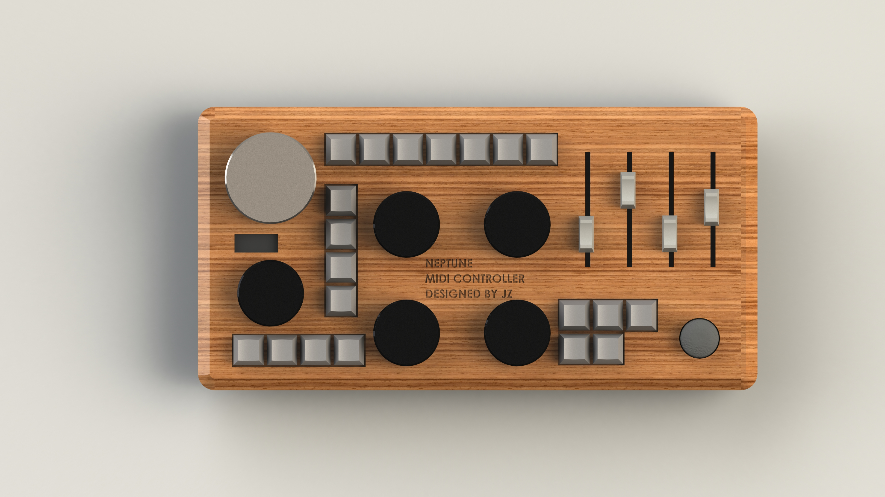
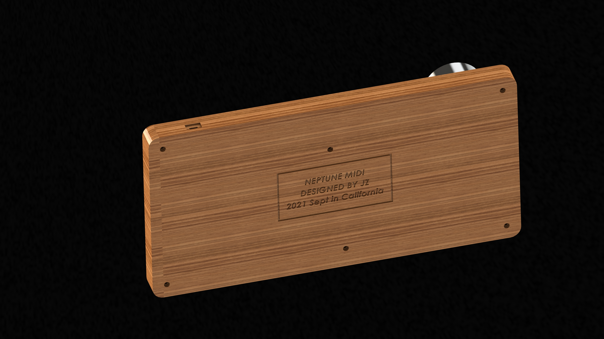

# Neptune MIDI Controller
A 3d printed MIDI controller that can be used for video and photo editing (Lightroom, Photoshop, Premiere, DaVinci Resolve, etc.). 
Both STLs and SolidWorks source files are included - feel free to fork and make your own version based on this!

## BOM
Disclaimer: Check dimensions before placing any order. 
Adjustments may be needed. 
Links provided are for reference only. 
I receive absolutely no commission.

-----------
| Name | Pcs Needed | Link |
| ----------- | ----------- | -------- |
| Slide Potentiometer |   4    | [Amazon](https://www.amazon.com/gp/product/B01CZVZ16O/ref=ppx_yo_dt_b_search_asin_title?ie=UTF8&psc=1) |
| Rotary Encoder (large) |   1    | [Amazon](https://www.amazon.com/gp/product/B00Y9KDDCY/ref=ppx_yo_dt_b_search_asin_title?ie=UTF8&th=1) |
| Rotary Encoder with Switch (small) |   5    | [Amazon](https://www.amazon.com/gp/product/B06XQTHDRR/ref=ppx_yo_dt_b_search_asin_title?ie=UTF8&psc=1) |
| Joystick |   1    | [Amazon](https://www.amazon.com/gp/product/B07YZT5NSW/ref=ppx_yo_dt_b_search_asin_title?ie=UTF8&psc=1) |
| Mechanical Keyboard Switch |   20    | [Amazon](https://www.amazon.com/gp/product/B0888JHM58/ref=ppx_yo_dt_b_search_asin_title?ie=UTF8&th=1) |
| OLED 128x32 Display |   1    | [Amazon](https://www.amazon.com/gp/product/B085NHM5TC/ref=ppx_yo_dt_b_search_asin_title?ie=UTF8&psc=1) |
| Teensy 4.1 |   1    | [Amazon](https://www.amazon.com/gp/product/B088D3FWR7/ref=ppx_yo_dt_b_search_asin_title?ie=UTF8&psc=1) |
-------

Note that everything in this BOM is optional. 
Feel free to replace any of them with any other type of input modules or controllers.

## Choosing a controller
I chose Teensy 4.1 because it has enough pins and, more importantly, Teensy boards have native USB support (i.e. no other interface chips needed between your microcontroller and USB). 
This makes uploading software way easier.
Checkout this link [MIDI over USB](https://tttapa.github.io/Control-Surface-doc/Doxygen/d8/d4a/md_pages_MIDI-over-USB.html) for more details.
***Do not use a board with CH340 USB interface.***
ATmega16U2 should be fine.

## Software
w.i.p. I'm using [Control Surface](https://tttapa.github.io/Control-Surface-doc/Doxygen/index.html) as the MIDI sender, and [MIDI2LR](https://rsjaffe.github.io/MIDI2LR/) as the bridge to Lightroom. Software is really simple once the hardware is built.